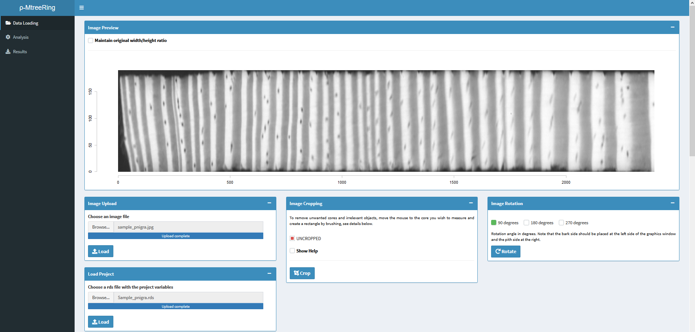

# ρ-MtreeRing  
## What is ρ-MtreeRing?
ρ-MtreeRing [[1](#references)] is a Free Open Source Software under [GLP-3 license](https://cran.r-project.org/web/licenses/GPL-3) for tree rings microdensity analysis on Shiny based on MtreeRing [[2](#references)].

If you use this software, *please cite*: García-Hidalgo, M.; García-Pedrero, Á.M.; Caetano-Sánchez, C.; Gómez-España, M.; Lillo-Saavedra, M.; Olano, J.M. ρ-MtreeRing: A Graphical User Interface for X-ray Microdensity Analysis. Forests 2021, 12, 1405. https://doi.org/10.3390/f12101405

## Installing ρ-MtreeRing
Download **app.R** file on your computer and launch it on R console or RStudio. 

In RStudio you need to click on the **Run App** option, we highly recommend open Shiny interface on browser by clicking on the upper-left displayed option `Open in Browser`.

<p align="center">
  
</p>

In R console, to display ρ-MtreeRing directly in your default web browser  you have to run the following command in the same directory of the **app.R** file: 

```rconsole
shiny::runApp() 
```

## Using ρ-MtreeRing

### Data Loading  

**Upload Sample Image**  
At *Image Upload* box, browse and select a X-ray digitalized image from your computer and click on `Load`. Image will be displayed on the *Image Preview* box and can be cropped to select the area of interest or rotated to led recent years (bark side) on the left of the image.

<p align="center">
  
</p>

**Light Calibration**  
Fill available boxes for thickness and intensity data or load them from a file with the stepped calibration wedge values. Afterwards, regression algorithm can be chosen from `Local regression` or `Cubic smoothing spline`. Once those data are fulfilled, click on the `Plot` button. Therefore, steps and regression curve will be displayed from *XRing* [[3](#references)] based script.  

<p align="center">
  
</p>


### Density Analysis

**Entry Sample Info**  
Complete Sample ID, Year of obtention, DPI and Sample thickness are required to obtain comparative values of ring width and density among different samples.  
At *Path Info* box, you can select the desired path mode (pay attention to ring detection requirements) and number of pixels to extract density profile.

<p align="center">
  
</p>


**Path Creation**  
In the *Main Window*, firstly select path limits by double-left-clicking on the left side (recent years) of the sample to place the beginning of the segment. Then, continue delimiting path segments across the sample perpendicularly to ring limits. If you need to zoom in/out the sample, you can use the zooming bars adjacent to the working window.
Path width for density extraction can be changed throughout the entire analysis. 

**Ring Detection and Editing**  
Once the desired path is set, confirm the ring selection method options at *Detection Options* box and click on `Run Detection for Years`. You can try different detection methods and path width to increase autodetection accuracy for your sample.
If, unfortunately, automatic ring detection did not work properly, you can modify ring borders on `Ring Editing` mode. One click on the desired ring border set a new border, while you can select one or multiple ring borders by clicking and dragging to delete them by clicking on `Delete Border`.

**Earlywood/Latewood Detection and Editing**  
For intra-annual border detection click on `Run Detection for Early-Late Wood`. Furthermore, you can edit those borders in the same way that for ring borders by enablig `Edit Early/Late Wood` box in the `Ring Editing` mode.

*WARNING*: In case you measure Earlywood/Latewood, number of intra-annual borders must be equal to number of ring borders.

<p align="center">
  
</p>

### Results

**Optional Sample Info**  
In this window you can complete various information about site, species, researcher or date.

**Output**  
Analysed measures can be exported on various formats:

1. *Comma Separated Values*. Containing density and ring measures.
2. *Excel format*. Containing density, ring measures and optional info.
3. *RWL*. Containing ring measures.
4. *Project at RDS format*. Containing data to reopen the project by loading it further on for corrections. 

<p align="center">
  
</p>


## References

[1] García-Hidalgo, Miguel, Ángel M. García-Pedrero, Cristina Caetano-Sánchez, Marcos Gómez-España, Mario Lillo-Saavedra, and José M. Olano 2021.
"ρ-MtreeRing: A Graphical User Interface for X-ray Microdensity Analysis"
Forests 12,
no. 10: 1405.
https://doi.org/10.3390/f12101405

[2] Jingning Shi, Wei Xiang, Qijing Liu, Sher Shah.
"MtreeRing: An R package with graphical user interface for automatic measurement of tree ring widths using image processing techniques".
Dendrochronologia,
Volume 58,
2019,
125644,
ISSN 1125-7865,
https://doi.org/10.1016/j.dendro.2019.125644.

[3] Filipe Campelo, Konrad Mayer, Michael Grabner.
"xRing—An R package to identify and measure tree-ring features using X-ray microdensity profiles".
Dendrochronologia,
Volume 53,
2019,
Pages 17-21,
ISSN 1125-7865,
https://doi.org/10.1016/j.dendro.2018.11.002.


